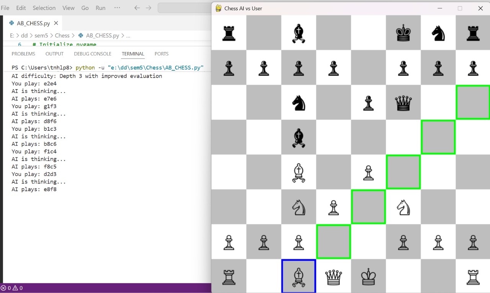

## Practical :- Chess AI (Python + Pygame) with MiniMax and Alpha-Beta Pruning  

---

### ● Problem Statement  
The **MiniMax Algorithm with Alpha-Beta Pruning** is widely used in Artificial Intelligence for two-player turn-based games.  
In Chess:  
- The **AI (Black)** minimizes the evaluation score.  
- The **Human (White)** maximizes the evaluation score.  

Alpha-Beta Pruning significantly reduces the number of nodes explored, making the algorithm more efficient than plain minimax.

---

### ● Objective  
- Implement **MiniMax Algorithm with Alpha-Beta Pruning** for Chess using Python.  
- Provide an **interactive GUI** using **Pygame**.  
- Ensure AI always makes the best possible move based on evaluation.  
- Use **piece-square tables** and material evaluation for better move decisions.  
- Display the board graphically, allow user to move by clicking, and declare results.  

---

### ● Data Structures Used  

| Component          | Data Structure         | Purpose |
|--------------------|------------------------|---------|
| Game board         | `python-chess` Board   | Standard chess rules & legality checks. |
| Evaluation         | Arrays (piece-square)  | Assign values to positions for each piece. |
| Moves              | `chess.Move`           | Generate all possible legal moves. |
| Alpha-Beta Pruning | Recursive `minimax()`  | Search game tree with pruning. |
| GUI                | `pygame`               | Render chessboard, pieces, and user input. |

---

### ● Algorithm  

**Scoring Function:**  
- Positive → Advantage for White (User).  
- Negative → Advantage for Black (AI).  

**Steps:**  
1. Initialize the chessboard with standard rules using `python-chess`.  
2. At each turn, check if game is over (checkmate, stalemate, draw).  
3. Use **minimax with alpha-beta pruning**:  
   - **Maximizer (White/User):** choose move with maximum evaluation.  
   - **Minimizer (Black/AI):** choose move with minimum evaluation.  
   - Apply pruning when `beta ≤ alpha`.  
4. Evaluation combines:  
   - **Material values** (Pawn=100, Knight=320, Bishop=330, Rook=500, Queen=900, King=20000).  
   - **Piece-square tables** for positional advantage.  
   - **Mobility** (number of legal moves).  
   - **Pawn structure** (doubled pawns penalty, passed pawns bonus).  
   - **King safety** depending on game phase.  
5. Render chessboard using `pygame` and update after every move.  

---

### ● Pseudocode  

```
FUNCTION minimax(board, depth, alpha, beta, isMaximizing):
    IF depth == 0 OR game over:
        RETURN evaluate(board)

    IF isMaximizing:
        best = -∞
        FOR each move in legal_moves:
            make move
            score = minimax(board, depth-1, alpha, beta, False)
            undo move
            best = max(best, score)
            alpha = max(alpha, score)
            IF beta ≤ alpha: BREAK
        RETURN best
    ELSE:
        best = +∞
        FOR each move in legal_moves:
            make move
            score = minimax(board, depth-1, alpha, beta, True)
            undo move
            best = min(best, score)
            beta = min(beta, score)
            IF beta ≤ alpha: BREAK
        RETURN best
```

---

### ● Sample Run  

```
Chess AI vs User
You are playing as White (bottom). Click to select and move pieces.
AI difficulty: Depth 3 with improved evaluation

You play: e2e4
AI is thinking...
AI plays: e7e5
```

On the GUI:  


---

### ● Use Cases  
1. **Play Chess** – Human vs AI opponent.  
2. **Game AI** – Demonstrates minimax + alpha-beta pruning in a real game.  
3. **Visualization** – Pygame provides intuitive interaction.  
4. **Education** – Learn Chess AI fundamentals.  

---

### ● Time and Space Complexity  

| Operation       | Time Complexity | Space Complexity |
|-----------------|-----------------|------------------|
| Minimax search  | O(b^(d/2)) avg  | O(d)             |
| Move generation | O(1) per piece  | O(1)             |
| **Overall**     | **O(b^(d/2))**  | **O(d)**         |

Where:  
- `b` = branching factor (~35 in Chess).  
- `d` = search depth (typically 3 for Python implementation).  

---

### ● Files Used  

| Filename        | Description |
|-----------------|-------------|
| `AB_CHESS.py`   | Python implementation with Pygame GUI and Alpha-Beta Pruning. |
| `README.md`     | Documentation for the Python implementation. |
